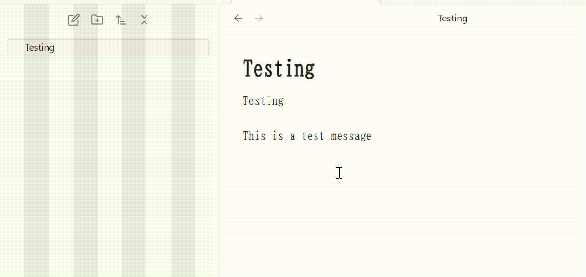

# Obsidian Virtual Symlink

This plugin is made for Obsidian.
By installing it, you can create a note that contains a link to the currently opened note.

このプラグインはObsidianのためのプラグインです。
このプラグインを導入することで、開いているノートへのリンクが記載された新しいノートを作成することができます。

## Motivation

I don't categorize notes using tags but rather folders. Therefore, I had to figure out how to categorize a note into multiple categories. I decided to create a note that contains a link to the currently opened note and place it in another folder. To automate this process, I developed this plugin.

私はノートを、タグでなくフォルダによって分類しています。
そのため、ある１つのノートを複数のフォルダに分類するためには工夫が必要です。
私は、そのノートへのリンクを記載したノートを手動で作成し、
元のノートの分類先とは別の分類先にそのノートを分類することにしました。
このプラグインは、この作業を自動化するために作成されました。
